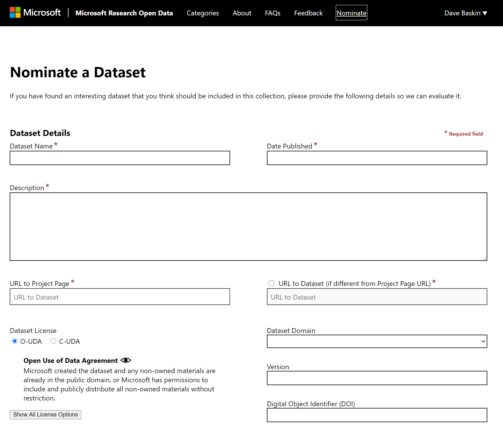
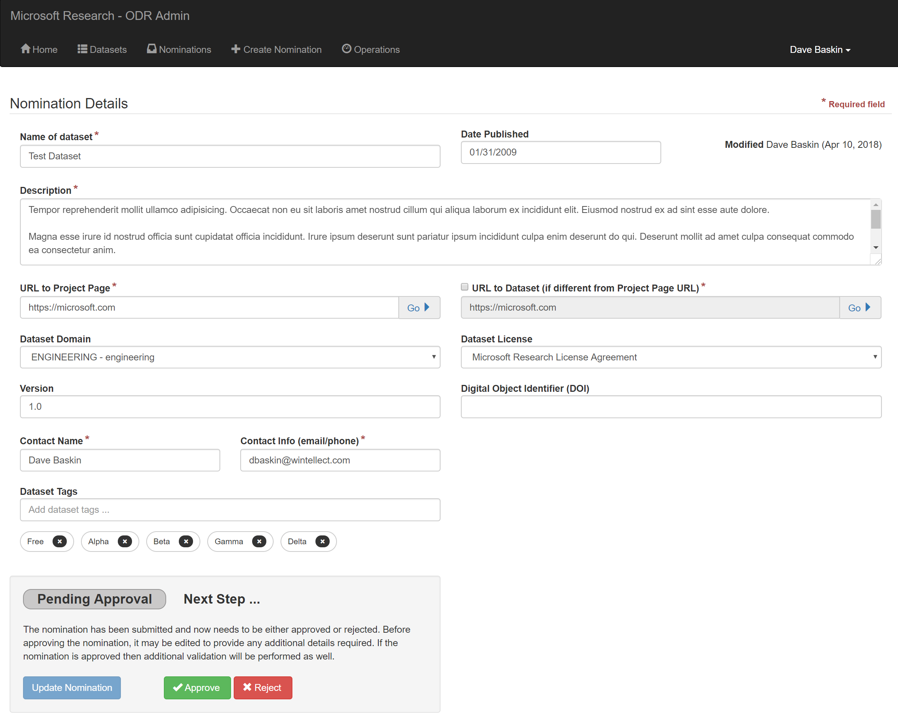
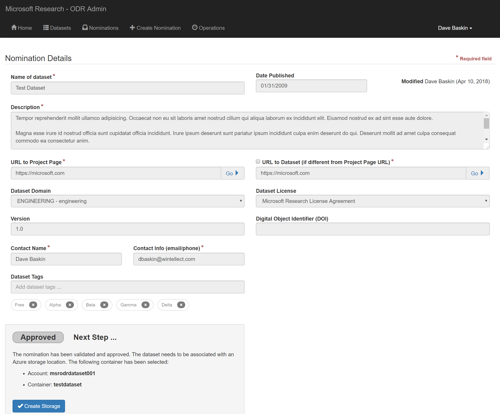
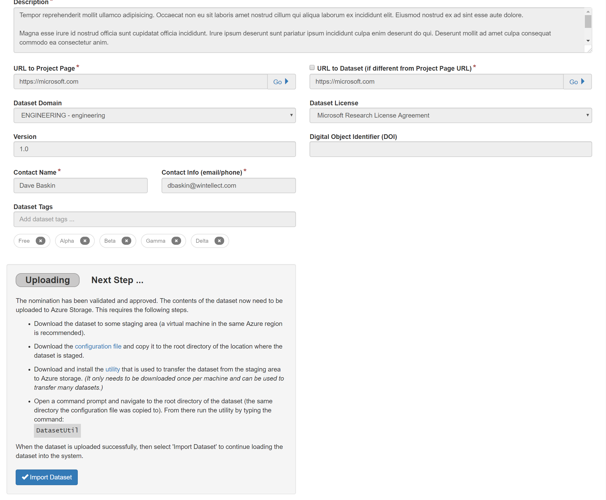
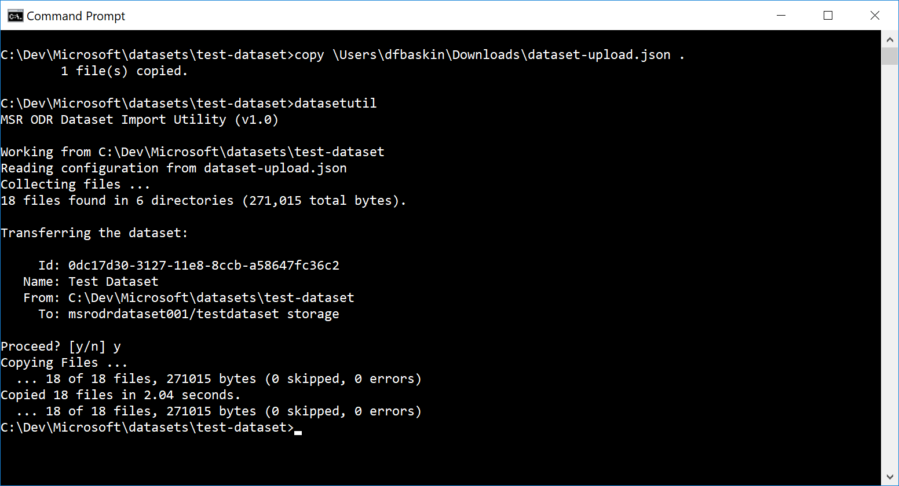
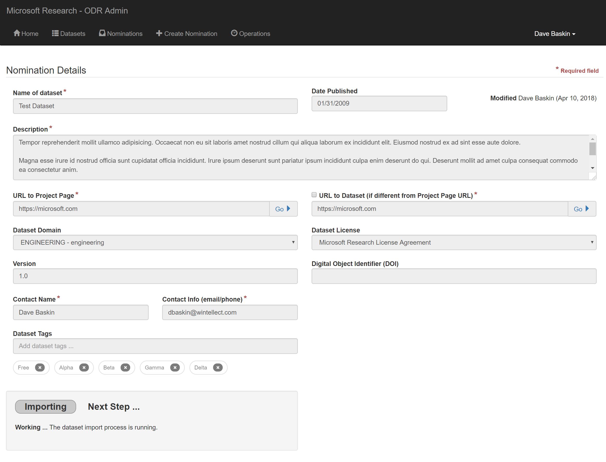
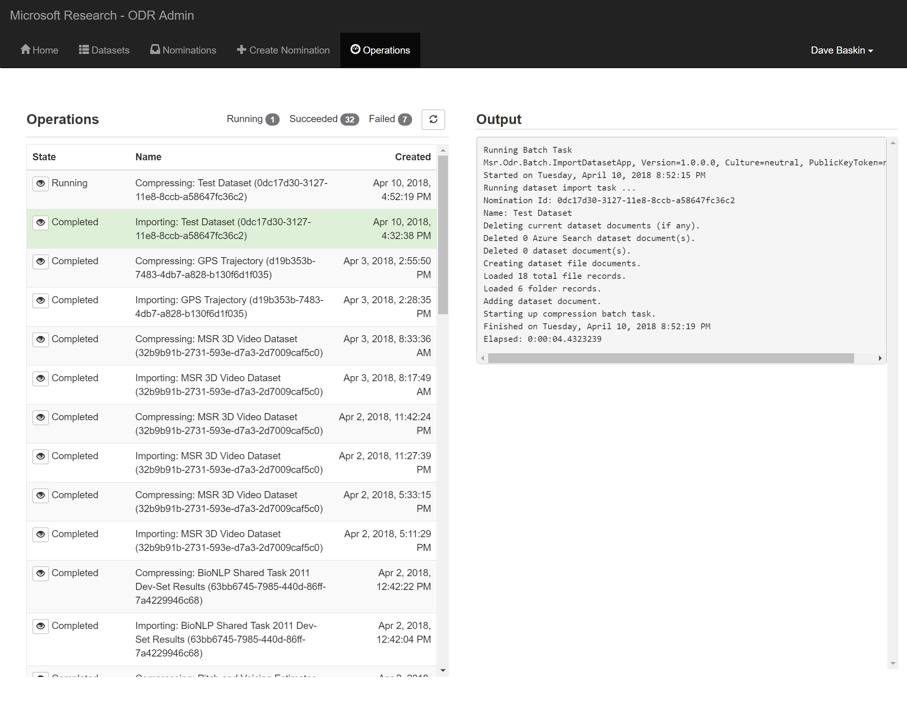
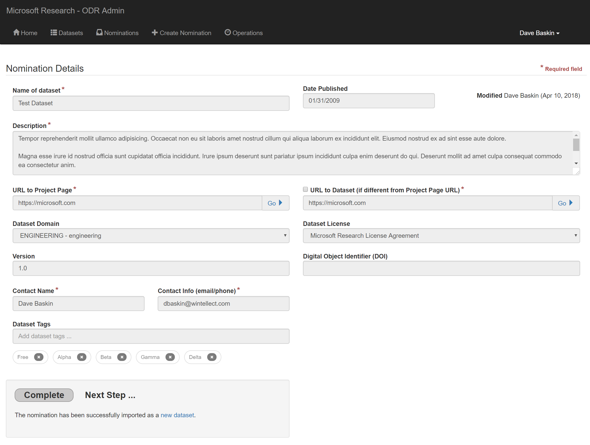

# Importing a Dataset

The dataset import process works through nominations.  A dataset is nominated
and then goes through a series of steps to be incorporated into the system.
This document provides details about these steps.

## Creating a Nomination

A nomination can be created by a user through the **Nominate** option in the
web application.

A nomination can also be created from the administration application.

## Editing and Approving a Nomination

Using the MSR ODR admin application, a user can view and edit the details
of the nomination.

Note that only at this point can changes be made to the nomination. Additional
validations will be performed to ensure that the data is correct before
incorporating the nomination into the system as a published dataset.

The user may either approve or reject the nomination. If the nomination
is rejected, then the process is finished.  If the nomination is approved,
then the system performs a series of additional steps.

## Assigning Storage for the Dataset

Currently, datasets are stored in Azure Storage. For each dataset, a container
is created that will include one or more blobs containing the files that are
in the dataset.

The user confirms where the dataset files will be stored.

The user selects the **Create Storage** button to create the container
in Azure Storage.

## Uploading Dataset Contents

> Note these instructions document uploading a datset using a small, Windows-based utility to upload the file. An alternative is to use the [Azure Storage Explorer](https://azure.microsoft.com/en-us/features/storage-explorer/) along with the SAS token found in the configuration file mentioned below.

The contents of a dataset are first manually copied to a staging area. For
very large datasets, the contents should be copied to a machine with a fast
connection to the Internet or on an Azure Virtual Machine instance in the
same region as the Azure Storage container created in the previous step.
This provides the fastest way to transfer the contents of the dataset
from the staging area to Azure.

Once the dataset is staged, then an additional utility is used to
upload this dataset.  This utility is provided a configuration
file that specifies the details of where the dataset contents should
be copied.  The utility itself is a Windows executable that can be
downloaded and installed on the staging machine.  This utility only
needs to be downloaded and installed once for the staging machine and
can be used to transfer multiple datasets staged on the machine.

The user takes the following steps:

- If not already installed, downloads and installs the utility that is used
to transfer the dataset from the staging area to Azure storage.
- Copies the contents of the dataset to the staging area, an isolated directory on the local machine (only the contents of the dataset should be in this staging directory).
- Downloads the configuration file and copies it to the root of the staging directory.
- Opens a command prompt and navigates to the staging directory. From there runs the utility by typing the command:

    `DatasetUtil`

After the dataset is uploaded successfully, the user selects
the **Import Dataset** button to continue loading the dataset into the system.

## Cataloging and Compressing Dataset

A process runs that catalogs information about the dataset, including the dataset
details and all of files associated with the dataset. This process creates the
appropriate records for users to explore the dataset itself.

This process runs using Azure Batch functionality. Since this import process
is not used frequently, the nodes used to run this process are released when
inactive (to save Azure costs). Therefore, if all the nodes are inactive,
it may take a few minutes for a processing node to spin back up.

But once a node is running, the catalog process begins. This process and
others can be monitored in the **Operations** tab on the admin application.

When the dataset catalog process is complete, then if the dataset is less than 2GB in size, a new process is started that compresses the dataset files into `.zip` and `.tar.gz` files.

## Finished

When the catalog process is complete, the dataset has been incorporated into
the main application (even if the compression process is still running).
It may take a few minutes to actually show up in the search index, however,
since Azure Search is configure to reindex the datasets every hour.

